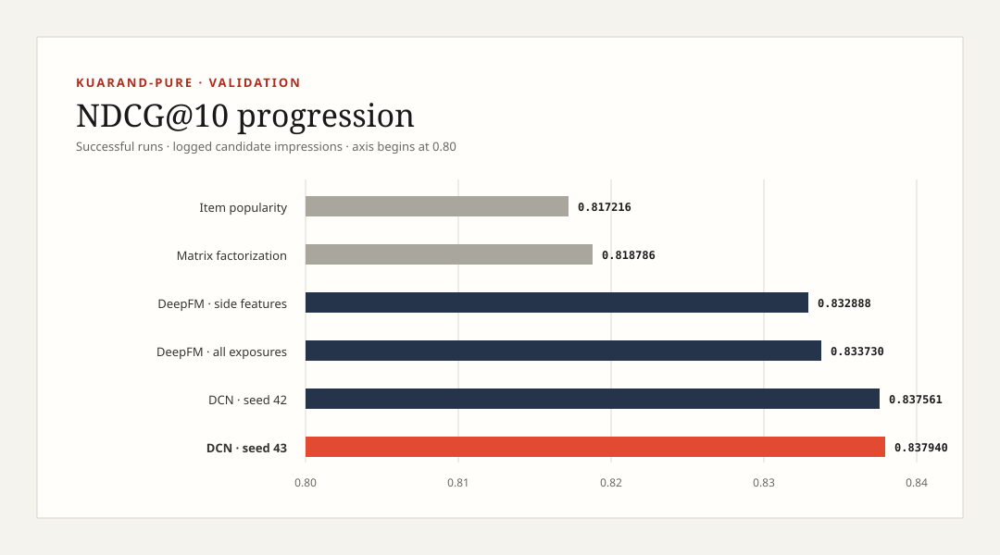

# Autonomous Recommender Research Agent — data and model pipeline

This repository contains the reproducible KuaiRand-Pure data/baseline pipeline
and configurable recommender-model component for the TikTok TechJam 2026
challenge. It is designed to feed a stable JSON contract to the autonomous
experiment controller.

Submission materials: [`docs/devpost.md`](docs/devpost.md),
[`docs/demo_script.md`](docs/demo_script.md),
[`docs/pitch_deck.md`](docs/pitch_deck.md), and
[`docs/submission_output.md`](docs/submission_output.md). Final human submission
steps are tracked in [`docs/submission_checklist.md`](docs/submission_checklist.md).
The interactive research console and exact product-scope explanation are in
[`docs/frontend.md`](docs/frontend.md). Checkpoint locations, checksums and the
recommended sharing workflow are in
[`docs/model_artifacts.md`](docs/model_artifacts.md).

## What is implemented

- A common model interface and registry with biased matrix factorization,
  DeepFM, DCN-v1, and a shared-bottom multi-task DCN trained on click plus
  permitted long-view/like/follow feedback.
- Training-only categorical vocabularies with an unknown bucket, so validation
  values never leak into feature fitting.
- Optional static user/video feature joins and temporal features (`hour`, day of
  week, weekend).
- Reproducible downsampling of *observed non-clicked impressions*. No unexposed
  user-item pairs or external data are introduced.
- Pointwise BCE, within-user BPR, and hybrid ranking/calibration objectives;
  pairwise negatives are drawn only from each user's logged exposures.
- YAML experiment configurations plus CLI overrides for controlled autonomous
  experiments.
- Early stopping on the mean of validation NDCG@10 and Recall@50, atomic
  validation-best checkpoints, gradient clipping, finite-loss checks, and a
  machine-readable `summary.json` history.
- CPU, Apple MPS, and CUDA device selection.
- Official archive download with published-MD5 verification, safe extraction,
  fixed row-half splitting, split checksums, and a leakage audit manifest.
- A one-command smoothed item-popularity baseline reporting both logged-candidate
  and full-catalog metrics.
- A result-driven OpenAI Responses API research policy with strict structured
  decisions and exact token accounting, plus an offline queued policy for
  reproducible cluster runs.
- Label-blind ranked prediction export with a SHA-256 manifest, and optional
  KuaiRand-1K preparation/training for bonus evaluation.

The code intentionally accepts only explicit `train.csv` and `validation.csv`
inputs. It has no test-data argument, which helps enforce the rule that the
hidden/test half is not accessed during model development.

## Setup

Python 3.10 or newer is required.

```bash
python -m venv .venv
source .venv/bin/activate
pip install -e '.[dev]'
```

Download, checksum, extract, split, and audit the official KuaiRand-Pure archive:

```bash
prepare-kuairand --download
```

The archive is verified against the MD5 published by KuaiRand. The resulting
directory is ignored by Git:

```text
data/
├── downloads/KuaiRand-Pure.tar.gz
├── raw/KuaiRand-Pure/...
└── prepared/
    ├── train.csv
    ├── validation.csv
    ├── test.csv
    ├── user_features_pure.csv
    ├── video_features_basic_pure.csv
    └── manifest.json
```

Prepared `train.csv` and `validation.csv` contain `user_id`, `video_id`, and
`is_click`. The feature presets also expect `tab` in the interaction logs and
the named columns from the official static user/video tables. Adjust
`categorical_features` if Member 1's prepared tables differ.

## Run experiments

Run the complete data-preparation and CPU item-popularity baseline with one
command:

```bash
run-kuairand-baseline --download
```

It writes `artifacts/baselines/item_popularity/{model.csv,summary.json}` and
prints both logged-impression and full-catalog validation metrics. See
[`docs/baseline_contract.md`](docs/baseline_contract.md) before comparing these
numbers with an organizer score: the public CWM task and the stated TechJam
click task are not identical.

Start with the cheap ID-only control:

```bash
train-recommender --config configs/mf_baseline.yaml
```

Then run the two meaningful architecture/feature experiments:

```bash
train-recommender --config configs/deepfm_features.yaml
train-recommender --config configs/dcn_features.yaml
```

Run the complete bounded autonomous sweep:

```bash
run-research-agent --config configs/agent.yaml
```

For model-driven selection, install the agent extra, configure credentials in
the environment (never the repository), and use the example OpenAI policy:

```bash
pip install -e '.[agent]'
export OPENAI_API_KEY=...
export OPENAI_MODEL=...
run-research-agent --config configs/nscc_hardened_sweep_openai.example.json
```

The model sees prior metrics, errors, recoveries, hypotheses, and bounded
configuration diffs, then selects the next experiment using a strict JSON
schema. Every decision records its rationale, reflection, source, and token use.

Replay one real, tightly cost-bounded decision over the completed experiment
history without retraining or exposing hidden labels:

```bash
set -a; source .env; set +a
PYTHONPATH=src python scripts/run_openai_policy_audit.py
```

The recorded GPT-5 mini decision is in
`reports/openai_policy_decision.json`; `.env` is excluded from both Git and
NSCC synchronization.

For a fast integration check, add `--smoke`. The real-data smoke sweep completes
six experiments with zero interventions and writes structured iteration,
recovery, resource, and convergence logs under `artifacts/agent_run/`.

The autonomous agent can change bounded settings without editing code:

```bash
train-recommender --config configs/deepfm_features.yaml \
  --set training.learning_rate=0.0005 \
  --set data.negative_ratio=8 \
  --set training.experiment_name=deepfm_lr5e4_neg8
```

Each run writes:

```text
artifacts/checkpoints/<experiment_name>/
├── best.pt       # validation-best weights, config, vocabulary, and metrics
└── summary.json  # complete epoch history and final best-checkpoint metrics
```

Model weights and generated prediction files are intentionally excluded by
the repository's `artifacts/` ignore rule. They remain available on the machine
that ran or downloaded them; see [`docs/model_artifacts.md`](docs/model_artifacts.md)
for the exact local paths and SHA-256 checksums of the selected models.

The CLI also prints the same JSON summary to standard output for Member 3's
agent controller. NDCG and Recall are macro-averaged over validation users with
at least one clicked impression.

Export a final ranked file without reading outcome labels:

```bash
export-recommendations \
  --checkpoint artifacts/checkpoints/<winner>/best.pt \
  --input-csv data/prepared/test.csv \
  --output-csv artifacts/submissions/kuairand_pure_top50.csv \
  --top-k 50 \
  --column-map configs/submission_column_map.example.json
```

The output columns are `user_id,video_id,score,rank`; a neighbouring
`.meta.json` records its checksum and confirms that no label columns were read.
The names can be mapped mechanically when the organizer publishes its exact
schema.

## Verified local results

The checked-in summary is in `reports/baseline_results.json`. On an 8 GB Apple
M2 MacBook Air:

| Model | Protocol | NDCG@10 | Recall@50 | Runtime |
|---|---|---:|---:|---:|
| Item popularity | Logged impressions | 0.817216 | 0.999867 | 1.7 s |
| Item popularity | Full 7,583-item catalog | 0.002785 | 0.021216 | 1.7 s |
| Matrix factorization | Logged impressions | 0.818786 | 0.999878 | 97.6 s |
| DeepFM, all logged negatives (A100) | Logged impressions | 0.833730 | 0.999921 | 58.8 s |
| DCN, long-schedule seed 43 (A100) | Logged impressions | **0.837940** | 0.999918 | 101.9 s |



The MF run stopped after 9 epochs and restored epoch 5. The NSCC sweep,
targeted tuning, hardened Pure sweeps, and OpenAI-selected third-seed
replication used 0.56667 PBS GPU-hours. The final
DCN used an 80-epoch ceiling, completed 12 epochs, and restored its
validation-best epoch 2 checkpoint. Seeds 42, 43, and 44 averaged 0.837502
NDCG@10 with a 0.000934 range, so seed sensitivity is reported rather than
hidden. GPT-5 mini selected seed 44 after reading 12 completed records; its
successful decision cost an estimated $0.001154 and the resulting model scored
0.837006. Detailed jobs, recovery, and
resource figures are in `reports/nscc_results.json`, with public iteration logs
in `reports/nscc_iterations.jsonl`. These are pipeline
verification results, not official leaderboard claims; the supplied challenge
text does not include the organizer evaluator or numeric CWM reference score.
Against the explicitly labelled internal popularity control, the final NDCG
gain is 0.020724 (2.54% relative); this is not presented as the missing official
CWM delta.

The optional KuaiRand-1K benchmark is also complete. Unlike the Pure logged
split, its median validation user has 4,682 candidates, no evaluated user has
50 or fewer, and Recall@50 is therefore discriminating. The side-feature
multi-task DCN reached **0.690004 NDCG@10 / 0.030152 Recall@50**, improving on
the strongest 1K ID/context control (0.667391 / 0.029048). It had a 30-epoch
ceiling, stopped after 6, and recovered automatically from two CUDA BLAS
initialization failures by reducing batch size to 1024.

## Recommended experiment sequence

1. `mf_baseline`: confirms the data/metric hand-off with the cheapest model.
2. `deepfm_features_neg4`: tests ID, context, static side, temporal, and
   second-order feature interactions together.
3. `dcn_features_neg4`: tests explicit high-order crosses on the same features.
4. For the better architecture, compare `negative_ratio` values `null`, `8`,
   and `4`; then tune embedding dimension (`16`, `32`) and learning rate.

Only change one factor per run so the agent's reflection log has a defensible
causal hypothesis. Select the final checkpoint by the configured validation
score, never by the held-out test result.

## Test

```bash
PYTEST_DISABLE_PLUGIN_AUTOLOAD=1 pytest -q
```

The tests cover feature leakage protection, temporal transforms, logged-negative
sampling, ranking metrics, multi-task training, result-driven policy selection,
prediction export, every model's forward/backward pass, and a complete
training/checkpoint smoke run. Disabling plugin autoload avoids interference from
unrelated pytest plugins installed in a shared Python environment; it is optional
inside a clean virtual environment.

## Frontend demo

This system ranks candidate videos by predicted click likelihood; it is not a
fake-video detector. The frontend includes three fictional personas backed by
anonymized KuaiRand users, real ranked candidates, content metadata,
relative-position explanations, the experiment workflow, and successful-result
graphs.

### Full local demo with the ranking API

From the repository root, install the package and start the server:

```bash
python -m venv .venv
source .venv/bin/activate
pip install -e .
serve-research-console --port 8080
```

Then open [http://127.0.0.1:8080](http://127.0.0.1:8080). The server reads
`artifacts/submissions/kuairand_pure_scores.csv` and exposes:

```text
GET /api/health
GET /api/sample-users
GET /api/rank?user_id=26469&limit=8
```

If the console script is not installed, the equivalent development command is:

```bash
PYTHONPATH=src python -m research_rec.demo_server --port 8080
```

### Static-only demo

The static frontend does not need PyTorch, a checkpoint, or an API key. It uses
embedded examples copied from the verified prediction export:

```bash
python -m http.server 8080 --directory .
```

Open [http://127.0.0.1:8080/frontend/](http://127.0.0.1:8080/frontend/).
Persona selection, explanations, navigation and graphs continue to work; users
outside the three embedded personas require the full local server.

This static mode is suitable for Vercel. It demonstrates verified model output
but does not claim that Vercel is executing the local PyTorch checkpoints. See
[`docs/frontend.md`](docs/frontend.md) for the complete interface and model-
scope contract.

## NSCC A100 execution

The repository includes password-safe SSH socket reuse, selective data sync,
scheduled native-PyTorch validation, PBS submission, monitoring, and result retrieval. Follow
[`docs/nscc.md`](docs/nscc.md). The full autonomous job is submitted with:

```bash
scripts/nscc_submit.sh agent
scripts/nscc_submit.sh hardened-sweep
```

The optional KuaiRand-1K bonus path is fully scheduled:

```bash
scripts/nscc_submit.sh bonus-prepare
scripts/nscc_submit.sh bonus-sweep
scripts/nscc_submit.sh bonus-side-sweep
scripts/nscc_submit.sh bonus-export kuairand_1k_side_multitask
```

## Integration boundary

The Member 1 data preparation and baseline implementation are included here.
Exact official metric parity remains pending the organizer's evaluator and
reference scores. `reports/official_source_audit.json` records the authoritative
sources checked and the missing artifacts rather than inventing an official
delta. Member 3 should invoke this CLI and consume its JSON output.
Member 4 can copy `summary.json` into iteration logs and compute GPU-hours from
the reported elapsed time plus the selected device. The raw dataset,
checkpoints, and credentials must remain uncommitted.

## Authoritative sources

- [TikTok TechJam 2026 submission requirements](https://tiktoktechjam2026.devpost.com/)
- [KuaiRand dataset documentation and published checksums](https://kuairand.com/)
- [Official KuaiRand archives on Zenodo](https://zenodo.org/records/10439422)
- [Upstream CWM implementation](https://github.com/hyz20/CWM)
- [OpenAI Responses API reference](https://developers.openai.com/api/reference/cli/resources/responses/methods/create)
