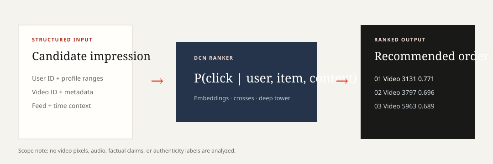

# LoopRank frontend and demo

## Product scope

LoopRank is a short-video **recommendation ranker**, not a fake-video or
deepfake detector. It receives structured candidate-impression fields and
estimates `P(click | user, video, context)`. It returns one score per candidate
and a descending rank for the user's feed.



The system does not inspect pixels, audio, speech, factual claims, provenance,
or authenticity labels. A genuine fake-video detector would require a different
dataset, media encoders, authenticity labels, and suitable detection metrics.

## Professional research console

The zero-build frontend is under `frontend/`. It contains three tabs:

1. **Overview** — scope, exact inputs/outputs and a live ranked-output explorer.
2. **How it works** — the autonomous research and ranking workflow.
3. **Results** — successful benchmark results, resource figures and an
   accessible NDCG@10 graph.

Three fictional demo personas are mapped to anonymized real KuaiRand user IDs.
Their activity/creator descriptors use supplied structured attributes and their
tables use actual exported model scores. Names are presentation aliases only;
the UI does not infer real identity or private preferences.

## Run it

Install the package, then start the local server from the repository root:

```bash
pip install -e .
serve-research-console --port 8080
```

Open `http://127.0.0.1:8080`. The server exposes:

- `GET /api/health` — task and service status;
- `GET /api/sample-users` — anonymized users with the largest candidate sets;
- `GET /api/rank?user_id=26469&limit=8` — actual label-blind ranked rows.

The page also works as a static file with embedded verified examples. Starting
the server enables all users in the local Pure prediction export.

## What verifies that the model works

- The selected Pure checkpoint was freshly loaded and scored 2,000 rows on CPU.
- Every checked score was finite and within `[0, 1]`.
- Per-user ranks were in descending score order and scores were non-constant.
- The complete 1K export contains 3,328,531 valid scores for 490 users.
- Offline ranking improved from 0.817216 to 0.837940 NDCG@10 against the
  explicitly labelled internal popularity control.
- Three-seed evaluation reports a 0.837502 mean and 0.000934 range.

Machine-readable evidence is in `reports/model_verification.json`. These checks
establish executable scoring and offline ranking quality; they do not establish
an official hidden-test score or causal online lift.
